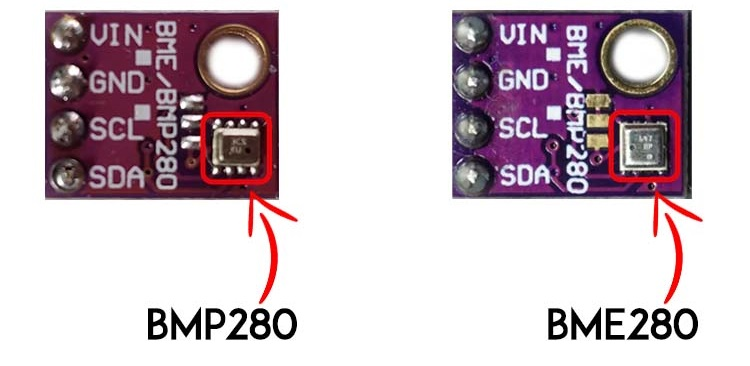

# Инструкция

## Оффлайн
### Сборка устройства
Для начала нужно купить все необходимые компоненты:
* ESP32-WROOM-32 devkit v1 (Микроконтроллер)
* BME280 (Измеряет погоду, влажность, давление)
* SCD-40 (Измеритель CO2)
* Oled-экран ssd1306 128x64p 

**ОБРАТИТЕ ВНИМАНИЕ! ВСЕ КОМПОНЕНТЫ ДОЛЖНЫ БЫТЬ НА I2C ШИНЕ!**

При покупке обратите внимание на то, как выглядит bme280, потому что из-за сходства с bmp280 часто происходит путаница!

Вот как выглядят все компоненты(С припаяными ножками):

*Фото комонентов*

Дальше вы должны осуществить подключение всех модулей в одно устройство

1. 3.3v(esp32) -> VIN(bme280) -> VDD(SCD-40, может называться VCC) -> VCC(ssd1306)
2. GND(esp32) -> GND(bme280) -> GND(SCD-40) -> GND(ssd1306)
3. D21(esp32) -> SDA(bme280) -> SDA(SCD-40) -> SDA(ssd1306)
4. D22(esp32) -> SCL(bme280) -> SCL(SCD-40) -> SCL(ssd1306)
